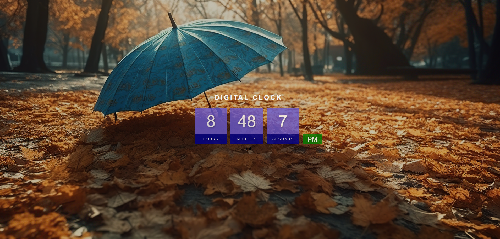

# Digital Clock

## Introduction
The Digital Clock project is a web application that displays the current time in a 12-hour format (AM/PM). It provides a visually appealing and functional digital clock that can be integrated into any website or used as a standalone application.

The project uses HTML for the structure, CSS for styling, and JavaScript's Date object to retrieve the current time. It demonstrates the power of JavaScript in handling date and time operations.

## Features
Real-time display of the current time, including hours, minutes, and seconds.
The clock updates dynamically, showing the current time without requiring page refresh.
Time displayed in a 12-hour format with AM and PM indication.
